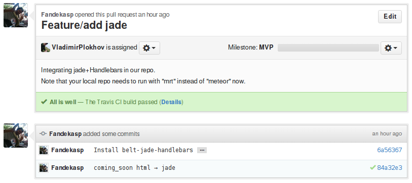

Guidance about Git
==================
Below are described the steps to get started with Git & Github.

Installing the repo
-------------------

Fork
~~~~
First, go to the `CoinsManager Github <https://github.com/CoinsManager/CoinsManager/>`_
and click on the **Fork** button:

This will create a clone of the main repository in your Github account.

Clone
~~~~~
In a shell, run:

.. code-block:: console

    $ git clone git@github.com:YourUsername/CoinsManager.git
    $ cd CoinsManager && git flow init

.. seealso:: :ref:`Copy repository for documentation <git-doc>`

Feature
~~~~~~~
So you cloned your repository and would like to work on some feature.
Because we are using the `Git Flow <http://nvie.com/posts/a-successful-git-branching-model/>`_,
you can create a new branch as follow:

.. code-block:: console

    $ git flow feature start my_new_feature
    $ git commit # as many times as needed
    $ git flow feature publish my_new_feature

.. tip::

    That git flow command is equivalent to
    ``git checkout -b feature/my_new_feature develop``

.. important::

    If you're going to work on a specific branch (for example
    **alpha**), and wish to use git flow for it, you'll need to change your
    :file:`.git/config` to match your new main development branch:

      .. image:: ../_static/git_gitflow_develop.png

Pull Request
~~~~~~~~~~~~
Great, you create your new code and it's available in your github repository.
But you would like to see it integrated in the main repository. How can you do
that ?

Go to your github repository, and you should see something like this:

Click on :guilabel:`Compare & pull request`, this will bring you to the pull
request interface.

Note that by default, your branches will always try to merge into the master
branch:

.. image:: ../_static/git_pull_request_from_1.png

Click on the :guilabel:`Edit` button and change it to the appropriate branch
(most often **develop**)

.. image:: ../_static/git_pull_request_from_2.png

Add a useless message to describe the feature that you want to merge, and press
:guilabel:`Send pull request`. Congratulations, you sent your first
contribution !

.. note::

    You can always add more commits after sending a pull request. Just
    push them to your feature branch, and the pull request will automatically
    be updated with it.

.. _git-remotes:

Remotes
~~~~~~~
You already did a contribution before, but want to do more, and your repository
became quite outdated compared to the upstream repository.

That's no problem ! Just add a remote for the upstream repository and rebase
from it:

.. code-block:: console

    $ git remote add upstream https://github.com/CoinsManager/CoinsManager.git
    $ git fetch upstream
    $ git checkout develop && git rebase upstream/develop

Then, if you've been working on a feature and also want to update that branch
with the latest:

.. code-block:: console

    $ git checkout feature/my_new_feature
    $ git rebase develop

It's a good idea to rebase often, to make the pull request as easy to merge as
possible for the core developers (you'll probably be asked to rebase your branch
and fix conflicts otherwise).

If your code doesn't break anything, you should see a successful Travis build
appear:

.. tip::

    We just added upstream as remote, but you can add as many remotes as
    you want. If you want to participate in a feature that is awaiting merging
    in a pull request, add that user repo as a new remote, and pull request
    directly to that user branch for the upstream pull request to be
    auto-updated !

Merge
~~~~~
If you are a power user, then you'll be able to accept pull requests from other
users. Go to the `Pull request page <https://github.com/CoinsManager/CoinsManager/pulls>`_,
select the pull request that you want to merge, and click on :guilabel:`Merge
pull request`.

.. image:: ../_static/git_merge.png

Merge conflict
~~~~~~~~~~~~~~
You tried to merge a pull request from Github, but it failed due to some
conflict. Two options are available:

* Merge is too difficult to resolve, or you lack time to resolve it: Ask the
  author of the pull request to rebase his feature from upstream (therefore
  he'll need to deal with the conflict, then ``push --force`` to update his
  github pull request)

  The Author would need to proceed as follow:

  .. code-block:: console

      $ git checkout feature/<NAME>
      $ git fetch upstream
      $ git rebase upstream/develop
      $ # RESOLVE CONFLICT
      $ git rebase --continue
      $ git push origin --force

  Then you can merge the pull request from Github without conflict.

* Do a merge a-la git flow:

  .. code-block:: console
  
      $ git remote add <CONTRIBUTOR> https://github.com/<CONTRIBUTOR>/CoinsManager.git
      $ git checkout -b feature/<NAME> <CONTRIBUTOR>/feature/<NAME>
      $ git checkout develop
      $ git fetch upstream
      $ git rebase upstream/origin
      $ git flow feature finish <NAME>
      $ # RESOLVE CONFLICT
      $ git commit
      $ git push upstream develop
